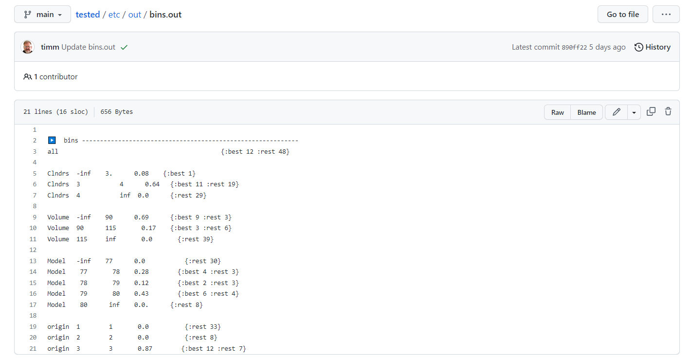
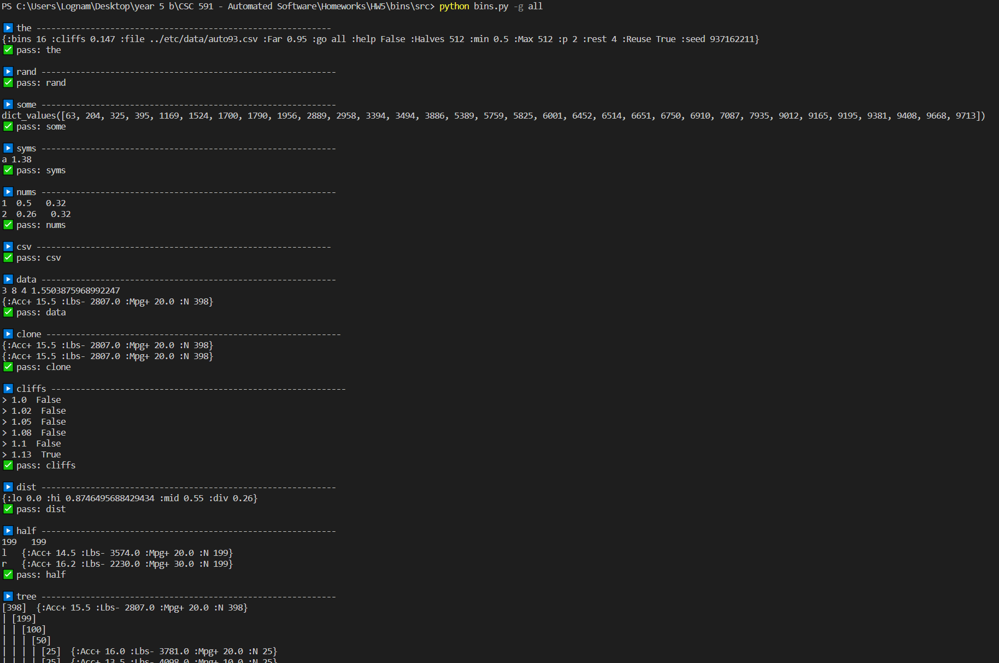

# bins

## This is the README file of HW5-bins (CSC 591, 2023)
Since this work is based on previous HWs, we do not explain details, in order to make it clear enough.

## Result:

* The [lua code for this HW is here](https://github.com/timm/tested/blob/main/src/bins.lua), and the [expected result](https://github.com/timm/tested/blob/main/etc/out/bins.out) is like:

* As for our result:

